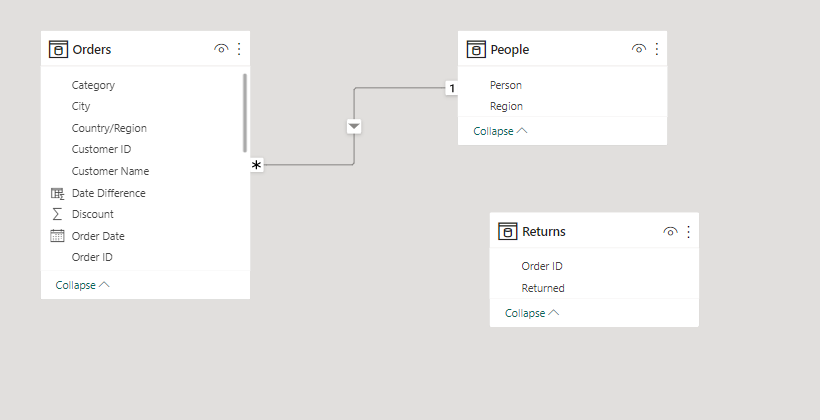
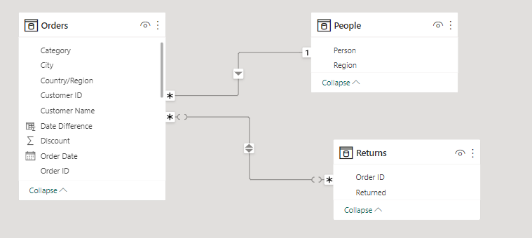
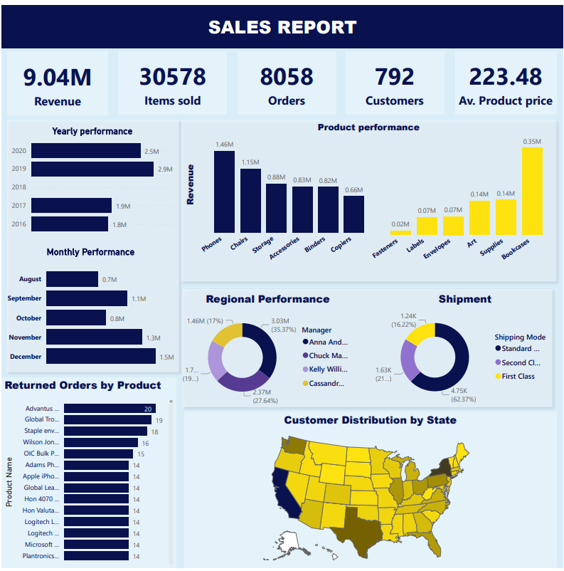

# Sales-Report
#### This is a sales report data of a retail store in United States showing the sales analysis from 2016 to 2020.

## Formating of table
#### I crated the Revenue column by multiplying the Quantity sold by sales which is the price and subtracted the discount price

#### I also created the diffence of the order sold date and delivery date and discovered some negative values which was filtered out using the filters

## Model
Original Model | My Model
----- | -----
 |  
this show only the relationship with regional managers | this connected the returned orders using the order ID 

## Report
 

## FINDINGS
#### At 1,464,227.02, Phones had the highest Revenue and was 122.62% higher than Copiers, which had the lowest Revenue at 657,710.17.
#### Anna Andreadi accounted for 35.37% of Sum of Revenue with location in the west with the highest number of customers and orders.
#### Revenue trended up, resulting in a 42.46% increase between 2016 and 2020.
#### Revenue started trending up on 2016, rising by 42.46% (756,468.29) in 4 years it was also notice there was no sales recorded for the year 2018.
#### Across Top 5 Months August to December, Sum of Revenue ranged from 706,195.27 to 1,488,149.16 the company.

### 1% return rate of products which sums to 800 return orders.

## RECOMMENDATION
* Availiability of the Top 6 products reguarly in the store,
* fasteners with the Least number of revenue had the highest number of return therefore baased on the data should not be stocked 
* Store can consider increasing staffs towards from November at the west, August for east and December for central  due to increased order number to help reduce return rate further.
* Cassandra seems to be doing a good job Handling orders and can hold a discussion on how to handle orders since she has no returned order recorded for the south

## Link to the Dashboard is [Here](https://app.powerbi.com/view?r=eyJrIjoiN2YxZjA0NjktZDhkYS00MDU0LTkxYjEtN2I0NWJhNTFmNDYzIiwidCI6IjFjZGQ5OTFjLTNkMmYtNDI2Zi04NGYyLTc4N2IwODRlYTc3OCJ9)
